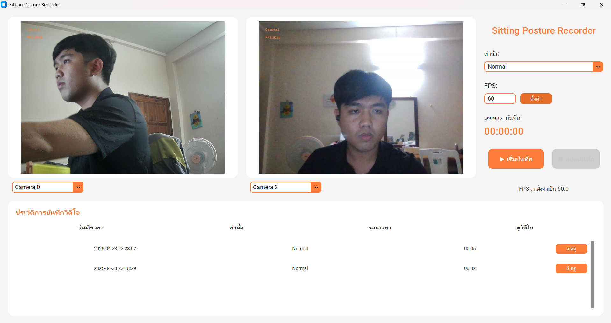

ระบบนี้ออกแบบโดยใช้ python tkinter โดยใช้งาน custom tkinter สำหรับตกแต่ง
โดยในระบบจะมัฟังก์ชั่นหลักคือ

1.เลือกกล้องที่ต้องการจะให้แสดงผล

2.ปรับFPSสำหรับการแสดงผล

3.บันทึกวิดีโอ --> ตั้งเวลาในการบันทึกวิดีโอ โดยมีให้เลือก 10 15 20 วินาที

4.ดูประวัติการบันทึกวิดีโอ --> สามารถลบวิดีโอได้เรียบร้อย

5.จับเวลาก่อนเริ่มบันทึกวิดีโอ และ แจ้งเตือนเมื่อต้องเปลี่ยนท่านั่งรวมถึงก่อนเริ่มบันทึกท่านั่งและนับถอยหลังก่อนเริ่มทำการจับท่านั่ง

6.ภาพตัวอย่างของท่านั่งแต่ละท่า

======In process=====

แก้ไขบั๊คเวลาไม่ตรงกับที่บันทึก เช่น เลือก 10 วินาที จะบันทึกได้แค่ 6 วินาที

